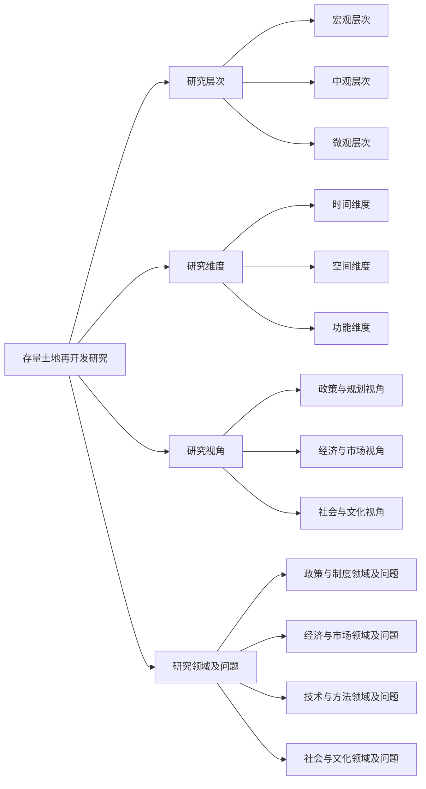

```mermaid
graph LR  
    A[存量土地再开发研究]  
    B[研究层次]  
    C[研究维度]  
    D[研究视角]  
    E[研究领域<br>及问题]  
  
    A --> B  
    A --> C  
    A --> D  
    A --> E  
  
    B --> B1(宏观层次)  
    B1 --> B1a(主题: 国家政策对存量土地再开发的影响)  
    B1a --> B1a_q1(问题: 如何评估国家政策对土地再利用率的影响？)  
    B1a --> B1a_q2(问题: 国家政策如何促进城市可持续发展？)  
  
    B --> B2(中观层次)  
    B2 --> B2a(主题: 城市再开发策略的有效性)  
    B2a --> B2a_q1(问题: 哪些再开发策略对城市更新最有效？)  
    B2a --> B2a_q2(问题: 如何评估再开发策略对城市景观和生态环境的影响？)  
  
    B --> B3(微观层次)  
    B3 --> B3a(主题: 地块或建筑再利用的最佳实践)  
    B3a --> B3a_q1(问题: 哪些因素决定地块或建筑的再利用方式？)  
    B3a --> B3a_q2(问题: 如何平衡历史建筑保护与再利用的关系？)  
  
    C --> C1(时间维度)  
    C1 --> C1a(主题: 存量土地再开发的时间趋势)  
    C1a --> C1a_q1(问题: 近年来存量土地再开发的趋势如何？)  
    C1a --> C1a_q2(问题: 如何预测未来土地再开发的方向？)  
  
    C --> C2(空间维度)  
    C2 --> C2a(主题: 空间布局优化)  
    C2a --> C2a_q1(问题: 如何合理规划存量土地的空间布局？)  
    C2a --> C2a_q2(问题: 哪些因素影响空间布局的决策？)  
  
    C --> C3(功能维度)  
    C3 --> C3a(主题: 土地再利用的功能转换)  
    C3a --> C3a_q1(问题: 如何确定土地再利用的最佳功能？)  
    C3a --> C3a_q2(问题: 功能转换如何影响周边社区的发展？)  
  
    D --> D1(政策与<br>规划视角)  
    D1 --> D1a(主题: 政策制定与执行)  
    D1a --> D1a_q1(问题: 如何制定有效的土地再开发政策？)  
    D1a --> D1a_q2(问题: 政策执行中的挑战和解决方案是什么？)  
  
    D --> D2(经济与<br>市场视角)  
    D2 --> D2a(主题: 经济效益与市场分析)  
    D2a --> D2a_q1(问题: 存量土地再开发的经济效益如何评估？)  
    D2a --> D2a_q2(问题: 市场需求如何影响再开发决策？)  
  
    D --> D3(社会与<br>文化视角)  
    D3 --> D3a(主题: 社会影响与文化传承)  
    D3a --> D3a_q1(问题: 再开发如何影响社区居民的生活？)  
    D3a --> D3a_q2(问题: 如何在再开发中保护和传承历史文化？)  
  
    E --> E1(政策与<br>制度领域<br>及问题)  
    E1 --> E1a(主题: 土地政策与制度创新)  
    E1a --> E1a_q1(问题: 当前土地政策存在哪些挑战？)  
    E1a --> E1a_q2(问题: 如何通过制度创新促进土地再开发？)  
  
    E --> E2(经济与<br>市场领域<br>及问题)  
    E2 --> E2a(主题: 市场机制与投资策略)  
    E2a --> E2a_q1(问题: 市场机制在土地再开发中的作用是什么？)  
    E2a --> E2a_q2(问题: 如何制定有效的投资策略来推动再开发？)  
  
    E --> E3(技术与<br>方法领域<br>及问题)  
    E3 --> E3a(主题: 新技术与方法的应用)  
    E3a --> E3a_q1(问题: 哪些新技术可以应用于土地再开发？)  
    E3a --> E3a_q2(问题: 如何评估新技术在再开发中的效果？)  
  
    E --> E4(社会与<br>文化领域<br>及问题)  
    E4 --> E4a(主题: 社会公平与文化保护)  
    E4a --> E4a_q1(问题: 如何确保再开发过程中的社会公平？)  
    E4a --> E4a_q2(问题: 再开发中如何保护和传承当地文化？)
    ```